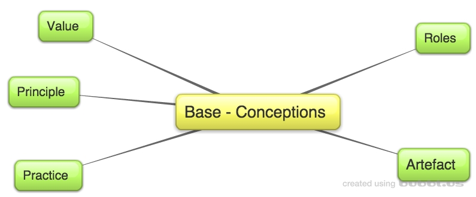
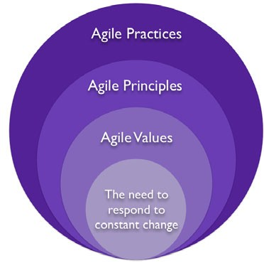

# Agile Process Model
Workshop to find a specific Process Model for a development Team by Horst Wendelmuth based on the [Bachelor-Thesis](https://github.com/wendelh/Bachelor-Thesis) from 2015.

## Description of the Agile Process Model as an Workshop

### Target of the Agile Process Model (APM)

General a Process Model for a Team will chosen from a company or supervisor. Frequently this decision is driven by topics from the organisation not by the requirements of the team. The most popular Models (Scrum, Kanban) are driven from messuring and flow. Doubtless important points. But for the development Team often other topics are more relevant.

This Workshop could help a Team to find specifics major Values und the concerning Practices. Afterwards the Team will define responsibilities for the Practices. At the end, the Team could build his "own" Process Model. Additional by the connection of Practices and Roles as responsibilities, there are a process to improve permanent the Process Model by the APM-Retro.

The main Target of this Workshop is to define a connection between Values, Practices and the concerning Role.  

### Agile Process Model Overview 

#### Conception of AgileValueModel

The Agile Process Model (APM) is summarise the needed areas of a Process Model as base conception. 

This Conceptions are devided in the following Areas:

This base conceptions are needed to describe a Process Model completely. Within this Workshop, the Team will find all relevant conceptions and by this process the Team it self will define his "own" process model.

#### From Values to Practices

The first entry point are the Values. Of course, many companies describe company Values. In this case, it could by helpfully to detect team Values as a specialization of comany Values. Otherwise to define team values independently are also a valid process. 

Based on the Team Values, the Principles and Practices will define. This three conceptions (Values, Principles, Practices) are directly connect by a relationship. By this idea, the Principles are based on the Values. And the Practices are based on the Principles. In this relationship between Values, Principles and Practices, the main targets of the team will concretely. At the end, the Practices are the visible resolution of the define Values. 

**Example for Value -> Principle x Practice:**

The Team believe in the Value *Communication* to reach there targets. In the following, the question will discuss how could the team live this value in there daily work? Based on the Value *Communication* the Team define the Principle *direct personal communication*. Concerning *direct personal communication** the Team discover the Practice *daily stand up* as a helpful tool.

Finely the team could describe the following relationship:

*Communication -> direct personal communication x daily stand up*

By this relationship the daily stand up is a visible evidence that the Team live the Value *Communication* in there daily work. Of course, it is needed to defined a set of several relationships to ensure that all aspects are included. 

#### From Practices to Artifacts

In the following step, the APM will give an answer of the question how will by handle the define Practices? All Practices are connected with an artifact. We could say, an artifact is the result of performing a Practice. Of course a Practice will performed by a person presented by a role of the team.  

So we could connect three basic conceptions by another relationship:

*Artifact -> Practice x Role*

In special cases it is valid, that the whole team is responsible for a Practice. For the example *Communication -> direct personal communication x daily stand up* the concerning relationship for the Role could be: *team -> daily stand up x task board*. Generally the most Practices will perfomed by a Role of the team. As an other example the Team could define the Value *Quality* and the concerning relationship *Quality -> Failed Fast x CI* The Practice *CI* will performed as an QA-Engineer. The relationship could be *Deployable -> QA-Engineer x CI*.

Every define Practice have to connect with a concerning Role and Artifact. Afterwards the Team has describe his own Process Model completely. This description cover all daily activities. It will ensure, that all Team Values will represent by a Practice and a Role is responsible for the performing. Additional this approach will ensure, that only Practices will performed witch are helpfully for the team. If the Team detect Practices without any relationship to a Value, this Practices provide no benefit and the Practice make no sense.      

#### APM-Retro

The define relationships have to prove the valence in the daily business. To check the benefit a APM-Retro could by helpfully. In this kind of Retro, the Team have to discuss how far the Values are represent in the daily work. By this Retro a permanently improvement of the Process Model have to ensure. 

It could be a good recommendation to define a collection of expectations and a fixed iteration. At the finish of the iteration the Team could check there own expectation on the process model in the APM-Retro and improve the define relationships. 

